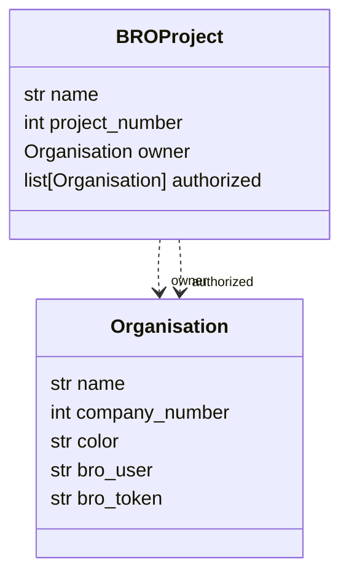

# ClassDiagram voor de overkoepelende BRO objecten #

# BRO

Voor de BRO zijn een aantal objecten overkoepelend.
Deze zijn dus relevant voor meer dan één object type.
Op dit moment onderscheiden we twee objecten:

1. De Organisatie
2. Het Project

## Organisaties

Uitleg over de werking van Organisaties....

## Projecten

Uitleg over de werking van Projecten....
