# Klassendiagram voor Formatieweerstand Dossiers (FRD) #

```mermaid
classDiagram
    class FormationResistanceDossier{
        str frd_bro_id
        delivery_accountable_party delivery_responsible_party
        str quality_regime
        str assessment_type
        groundwater_monitoring_tube
        groundwater_monitoring_net
        bool deliver_to_bro
        date closure_date
        bool closed_in_bro
        }
    class ElectromagneticMearsElectromagneticMeasurementMethod{
        formation_resistance_dossier
        date measurement_date
        measuring_responsible_party
        str measuring_procedure
        str assessment_procedure
    }
    class InstrumentConfiguration{
        formation_resistance_dossier
        str configuration_name
        electromagnetic_measurement_method
        float relative_position_send_coil
        float relative_position_receive_coil
        str secondary_receive_coil
        float relative_position_secondary_coil
        str coilfrequency_known
        float coilfrequency
        float instrument_length
    }
    class GeoOhmMeasurementMethod{
        formation_resistance_dossier
        date measurement_date
        measuring_responsible_party
        str measuring_procedure
        str assessment_procedure
    }
    class GMWElectrodeReference{
        int cable_number
        int electrode_number
    }
    class ElectrodePair{
        elektrode1
        elektrode2
    }
    class MeasurementConfiguration{
        formation_resistance_dossier
        str configuration_name
        measurement_pair
        flowcurrent_pair
    }
    class ElectromagneticSeries{
        electromagnetic_measurement_method
    }
    class GeoOhmMeasurementValue{
        geo_ohm_measurement_method
        float formationresistance
        measurement_configuration
        datetime datetime
    }
    class ElectromagneticRecord{
        series
        float vertical_position
        float primary_measurement
        float secondary_measurement
    }
    class CalculatedFormationresistanceMethod{
        geo_ohm_measurement_method
        electromagnetic_measurement_method
        str responsible_party
        str assessment_procedure
    }
    class FormationresistanceSeries{
        calculated_formationresistance
    }
    class FormationresistanceRecord{
        series
        float vertical_position
        float formationresistance
        str status_qualitycontrol
    }
    class FrdSyncLog{
        bool synced
        datetime date_modified
        str bro_id
        str event_type
        frd
        geo_ohm_measuring_method
        electomagnetic_method
        str process_status
        str comment
        str xml_filepath
        int delivery_status
        str delivery_status_info
        str delivery_id
        str delivery_type
    }

```

# FRD - Formatieweerstand Dossiers 

Binnen deze groep vallen de dossiers, en alle benodigde objecten voor de samenstelling hiervan, die gaan over zoutwachter metingen.
Hieronder 

## Organisaties

Uitleg over de werking van Organisaties....

## Projecten

Uitleg over de werking van Projecten....