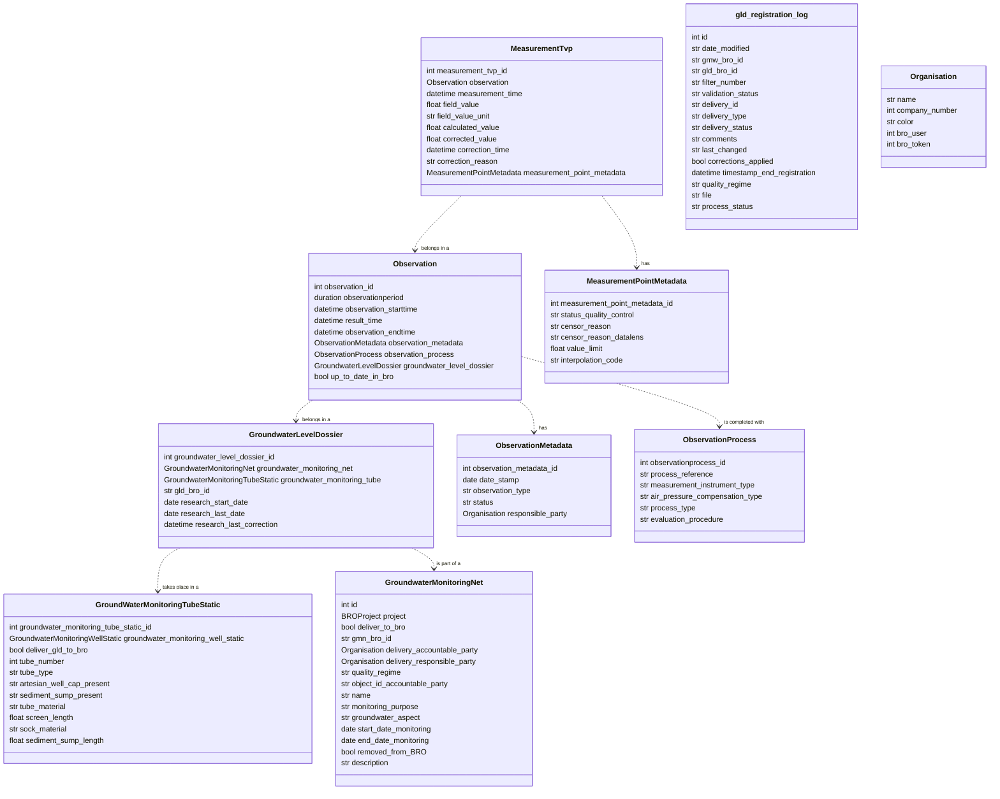

# Klassendiagram voor Grondwaterstand dossiers (GLD)

# Beschrijving

Onder het registratieobject kun je de volgende objecten beheren: GrondwaterstandsDossiers, Observaties, Meetpunt metadata, Meting en tijdwaarde paren, Ovservatie metadata, GLD registratie logs, GLD toevoegings logs

# Functies

Voor ieder object kun je in de Bro-connector een CRUD vinden waarin je gemakkelijk alle registratieobjecten kunt beheren.

# Commando's

### gld_additions_qc_quality_control

Gebruikswijze:
`python python manage.py gld_additions_qc_quality_control`

### gld_sync_to_bro

Gebruikswijze:
`python python manage.py gld_sync_to_bro`
Omschrijving:
Dit commando synchroniseert alle onderliggende objecten naar BRO.
