# ClassDiagram voor Groundwatermonitoring Meetnetten (GMN) #

```mermaid
classDiagram
    
    class GroundwaterMonitoringNet{
        int groundwater_monitoring_well_static_id
        str registration_object_type
        int bro_id
        int project
        str request_reference
        int delivery_acountable_party
        int deliverable_responsible_party
        str quality_regime
        str under_privilege
        str delivery_context
        str construction_standard
        str initial_function
        str nitg_code
        str olga_code
        str well_code
        int monitoring_pdok_id
        point coordinates
        point coordinates_4236
        str reference_system
        str horizontal_positioning_method
        str local_vertical_reference_point
        double well_offset
        str vertical_datum
        bool in_management
        bool deliver_gmw_to_bro
        bool complete_bro
        date last_horizontal_positioning_date
        point construction_coordinates
    }
    class MeasuringPoint{
        GroundwaterMonitoringNet gmn
        GroundWaterMonitoringTubeStatic groundwater_monitoring_tube
        str code
        bool synced_to_bro
        date added_to_gmn_date
        date deleted_from_gmn_date
        bool removed_from_BRO_gmn
    }
    class IntermediateEvent{
        GroundWaterMonitoringNet gmn
        str event_type
        date event_date
        bool synced_to_bro
        MeasuringPoint measuring_point
        bool deliver_to_bro
    }
    class BROProject{
        str name
        int project_number
        Organisation owner
        list[Organisation] authorized
    }
    
    class Organisation{
        str name
        int company_number
        str color
        int bro_user
        int bro_token
    }
    class gmn_bro_sync_log{
        date date_modified
        str event_type
        str gmn_bro_id
        str object_id_accountable_party
        str validation_status
        str delivery_id
        str delivery_type
        str delivery_status
        str delivery_status_info
        str comments
        str last_changed
        bool corrections_applied
        date timestamp_end_registration
        str quality_regime
        str file
        str process_status
        MeasuringPoint measuringpoint
    }
    class GroundWaterMonitoringTubeStatic{
        int groundwater_monitoring_tube_static_id
        GroundwaterMonitoringWellStatic groundwater_monitoring_well_static
        bool deliver_gld_to_bro
        int tube_number
        str tube_type
        str artesian_well_cap_present
        str sediment_sump_present
        str tube_material
        float screen_length
        str sock_material
        float sediment_sump_length
    }
    class GroundwaterMonitoringWellStatic{
        int groundwater_monitoring_well_static_id
        str registration_object_type
        str bro_id
        BROProject project
        str request_reference
        Organisation delivery_accountable_party
        Organisation delivery_responsible_party
        str quality_regime
        str under_privilege
        str delivery_context
        str construction_standard
        str initial_function
        str nitg_code
        str olga_code
        str well_code
        int monitoring_pdok_id
        point coordinates
        point coordinates_4236
        str reference_system
        str horizontal_positioning_method
        str local_vertical_reference_point
        float well_offset
        str vertical_datum
        bool in_management
        bool deliver_gmw_to_bro
        bool complete_bro
        date last_horizontal_positioning_date
        point construction_coordinates
    }
    GroundwaterMonitoringNet ..> "project" BROProject
    GroundwaterMonitoringNet ..> "delivery_accountable_party" Organisation
    GroundwaterMonitoringNet ..> "delivery_responsible_party" Organisation
    BROProject ..> "authorized" Organisation
    BROProject ..> "owner" Organisation
    MeasuringPoint ..> "groundwater_monitoring_tube" GroundWaterMonitoringTubeStatic
    MeasuringPoint ..> "gmn" GroundwaterMonitoringNet 
    GroundWaterMonitoringTubeStatic ..> "groundwater_monitoring_well_static" GroundwaterMonitoringWellStatic
    GroundwaterMonitoringWellStatic ..> "delivery_accountable_party" Organisation
    GroundwaterMonitoringWellStatic ..> "delivery_responsible_party" Organisation
    GroundwaterMonitoringWellStatic ..> "project" BROProject
    
    gmn_bro_sync_log ..> "measuring_point" MeasuringPoint
    IntermediateEvent ..> "measuring_point" MeasuringPoint
    IntermediateEvent ..> "gmn" GroundwaterMonitoringNet
```

# Beschrijving #
Onder GMN vind je een CRUD voor de GroundwaterMonitoring Meetnetten, meetpunten en tussentijdse gebeurtenissen.
# Functies #
### Delete selected Groundwater monitoring Meetnetten ###
Deze functie verwijderd alle geselecteerde objecten.
### Deliver GMN to BRO ###
Deze functie verstuurd alle geselecteerde objecten naar BRO.
### Check GMN status from BRO ###
Deze functie haalt de laatste status van de geselecteerde objecten op vanuit BRO en update deze in de lokale database.
# Commando's #
### gmn_create_provinciaal_meetnet ###
Gebruikswijze:
```python gmn_create_provinciaal_meetnet {meetnet_naam}```
Dit commando kan worden gebruikt om een nieuw meetnet op te zetten. Er wordt automatisch gechecked of er al een meetnet bestaat met de opgegeven naam.
### gmn_sync_to_bro ###
Gebruikswijze:
```python python manage.py gmn_sync_to_bro```
Dit commando synchroniseert alle onderliggende objecten naar BRO. Dit commando doet hetzelfde als Deliver GMN to BRO in de CRUD voor GMN objecten.
