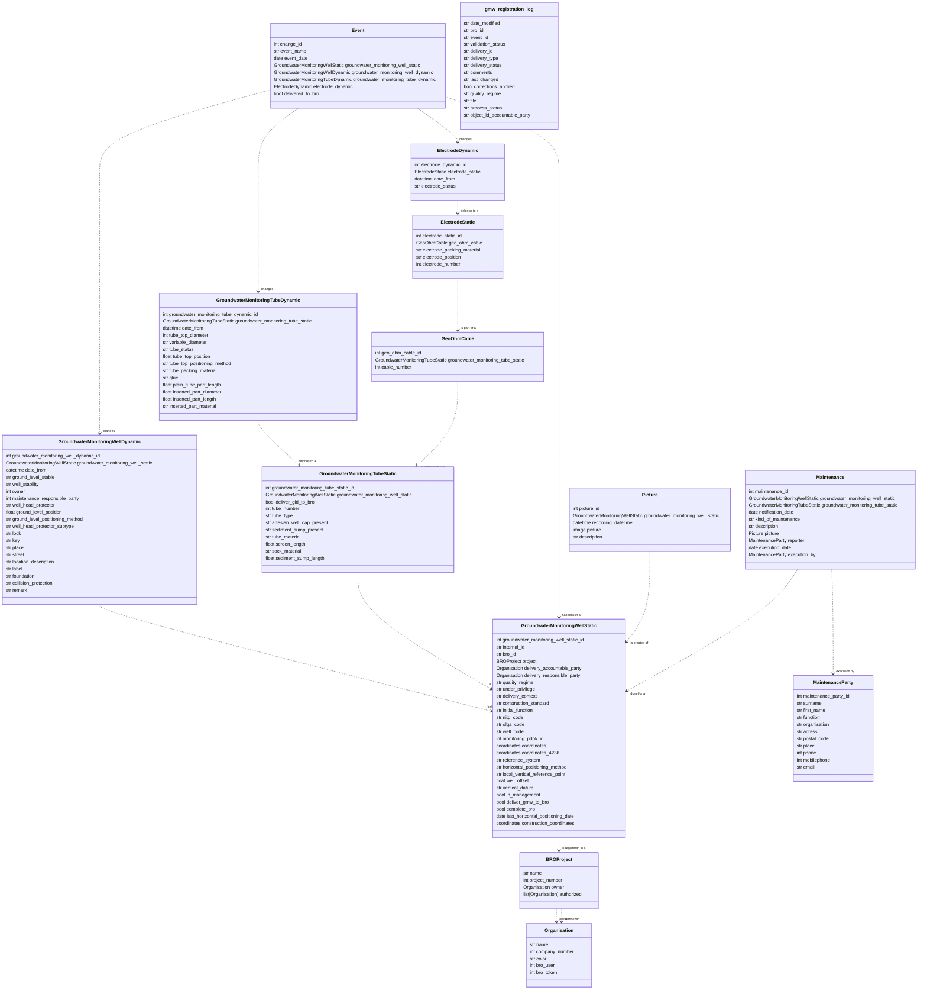

# Klassendiagram voor Grondwatermonitoringsput (GMW) #

# GMW - Grondwatermonitoringsput

De Grondwatermonitoringsput is één van de meest belangrijke, en complexe, objecten binnen de BRO.
Eén of meerdere putten zijn nodig voor alle andere object-types binnen het grondwaterdomein van de BRO.

Binnen de BRO-Connector zijn alle relevante objecten die vallen binnen het GMW domein opgenomen.
Voor de attributen die door de tijd heen kunnen verschillen zijn aparte objecten aangemaakt: "statisch" voor de constante* variabelen en "dynamisch" voor flexibele variabelen.

*Er zijn een aantal attributen die op het moment onder de statische sub-groep vallen, die potentieel wel kunnen veranderen. Deze veranderingen gaan gepaard met berichten die op het moment nog niet worden ondersteund in de applicatie, vandaar hun indeling in de app. (Eigenaar, coordinaten -> Dit zijn gegevens die wel mogelijk veranderen of bijgesteld worden.)

## Grondwatermonitorings Put - Statisch

Het hoofd-object binnen de GMW categorie. Alle andere objecten zijn op een manier terug te leiden naar deze.
Vanuit deze object-groep zijn dan ook de belangrijkste acties beschikbaar:

1. Deliver GMW to BRO: Levert alle relevante gebeurtenissen voor de geselecteerde putten aan de BRO (waar mogelijk).
2. Check GMW Status from BRO: Controleert de status van een put, als er een levering te vinden is in de logs.
3. Generate FieldForm: Genereerd een locaties bestand voor de FieldForm mobiele-app. FTP-instellingen noodzakelijk.
4. Delete selected: Standaard functionaliteit binnen Django om meerdere entiteiten te verwijderen.
